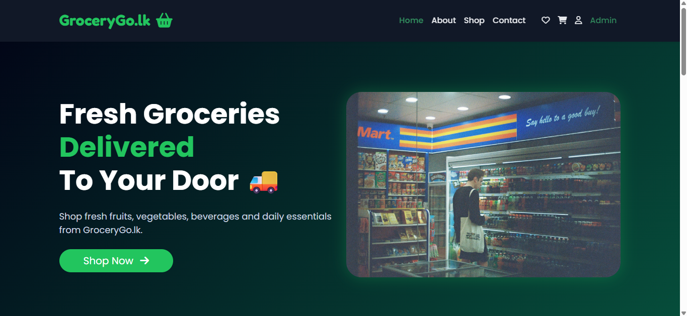
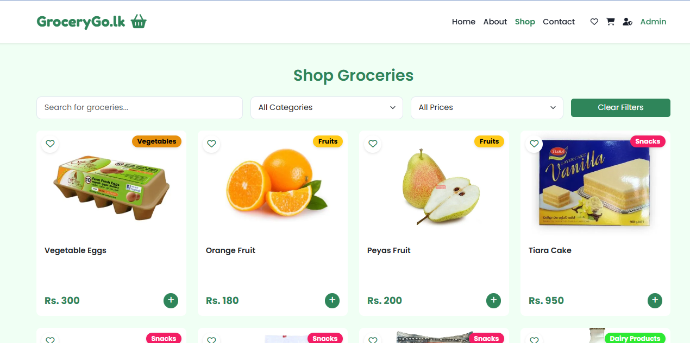
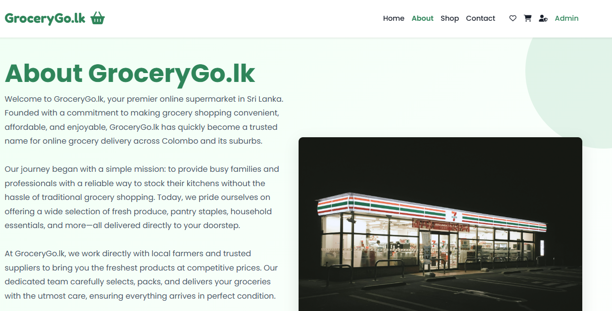
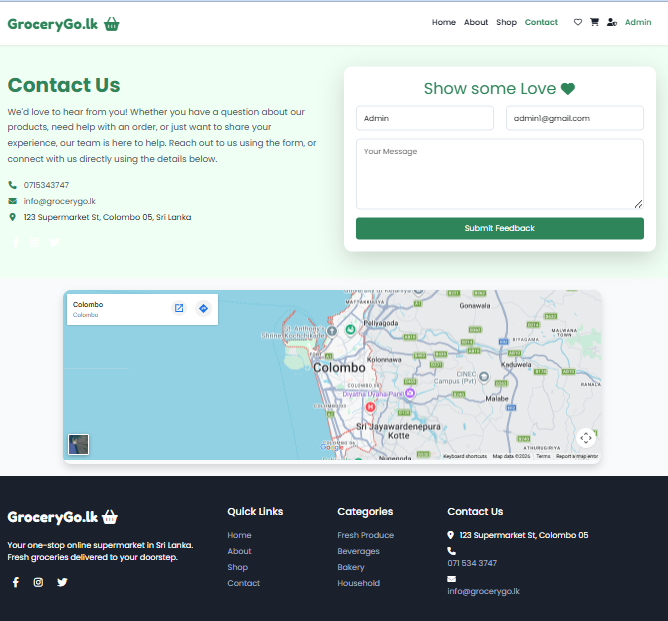
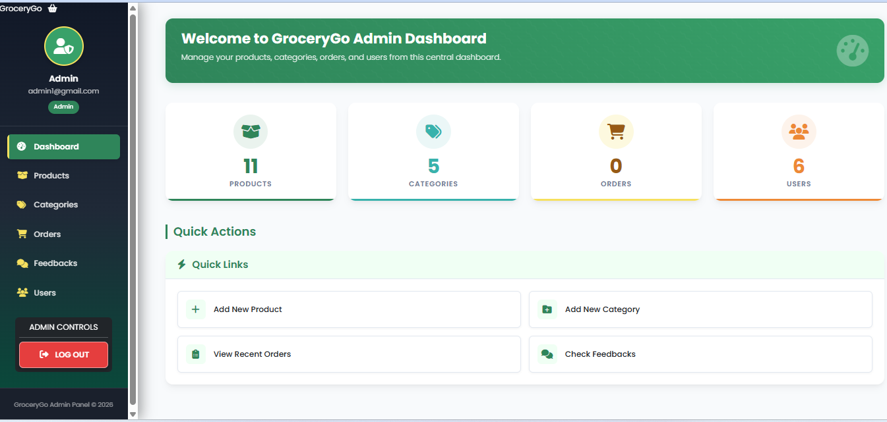

# GroceryGo.lk - Online Supermarket

GroceryGo.lk is a comprehensive online grocery shopping platform for Sri Lanka. Built with PHP and MySQL, it features a modern, responsive design using Bootstrap 5, user-friendly navigation, and a seamless shopping experience from browsing products to checkout.

## Features

- **User Authentication System**
  - Secure sign-up and login functionality
  - User profiles with order history
  - Role-based access (users and administrators)

- **Product Management**
  - Browse products by categories
  - Featured products section
  - Product details with images and descriptions
  - Search functionality for quick product finding

- **Shopping Experience**
  - Intuitive cart management
  - Wishlist functionality for saving favorite items
  - Responsive design for mobile, tablet, and desktop
  - Real-time cart and wishlist updates

- **Admin Dashboard**
  - Product inventory management
  - Order processing and status updates
  - Category management
  - User management
  - Feedback monitoring

- **Customer Engagement**
  - Testimonials and reviews
  - Contact form for customer inquiries
  - Responsive slider for promotional content
 
# 📷 Screenshots

## Home Page



---

## Shop Page



---

## About page



---

## Contact page



---

## Admin Dashboard 



---


## Project Structure

```
GroceryGo/
├── index.php             # Homepage
├── config/               # Database configuration
├── controller/           # PHP controllers for processing actions
├── includes/             # Reusable header/footer components
├── public/               # Public assets
│   ├── css/              # CSS stylesheets
│   ├── img/              # Image files
│   └── js/               # JavaScript files
├── sql/                  # Database SQL files
├── uploads/              # Uploaded product images
└── views/                # PHP view files
    ├── admin/            # Admin dashboard views
    └── user/             # User profile and order views
```

## Getting Started

1. **Clone or download the repository**
2. **Set up a local web server environment (XAMPP, WAMP, or MAMP)**
3. **Import the database**
   - Create a database named 'grocerygo'
   - Import the SQL file from the 'sql' directory
4. **Configure the database connection**
   - Update database credentials in 'config/db.php'
5. **Access the site through your local server**
   - e.g., http://localhost/GroceryGo

## Dependencies

- [PHP](https://www.php.net/) (>= 7.4 recommended)
- [MySQL](https://www.mysql.com/)
- [Bootstrap 5](https://getbootstrap.com/)
- [Font Awesome 6](https://fontawesome.com/)
- [Google Fonts - Poppins & Fredoka One](https://fonts.google.com/)
- [SweetAlert2](https://sweetalert2.github.io/)

## Admin Access

- **URL:** /views/admin/dashboard.php
- **Default credentials:**
  - Email: admin@grocerygo.lk
  - Password: admin123

## License

This project is for educational and demonstration purposes. You may use and modify it for your own grocery e-commerce platform or similar business.

---

**GroceryGo.lk** – Your groceries, delivered to your doorstep in Colombo and suburbs.
